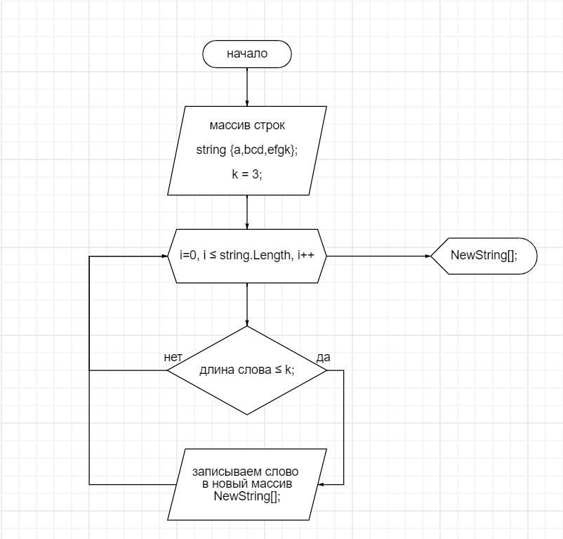

# Решение задачи по поиску слов.

## Задача.   

Написать программу, которая из имеющегося массива строк формирует новый массив из строк, длина которых меньше, либо равна 3 символам. Первоначальный массив можно ввести с клавиатуры, либо задать на старте выполнения алгоритма. При решении не рекомендуется пользоваться коллекциями, лучше обойтись исключительно массивами.

## Блок схема 
   
Решение окажется немножко сложнее, но начало положено!

## Решение
Для решения такой задачи определенно понадобится новый массив, куда мы и будем складывать результаты поиска.   
Так как заранее неизвестно сколько будет слов в результате, я решил их сначала посчитать с помощью цикла, _**чтобы указать размерность финального массива**_.

После этого можно использовать еще один цикл, который и будет записывать в наш массив результат поиска.

Также понадобится **функция вывода масива**. При этом я решил написать условие проверки, если финальный массив окажется пустым. Чтобы пользователь **не видел пустую строку при результате.**